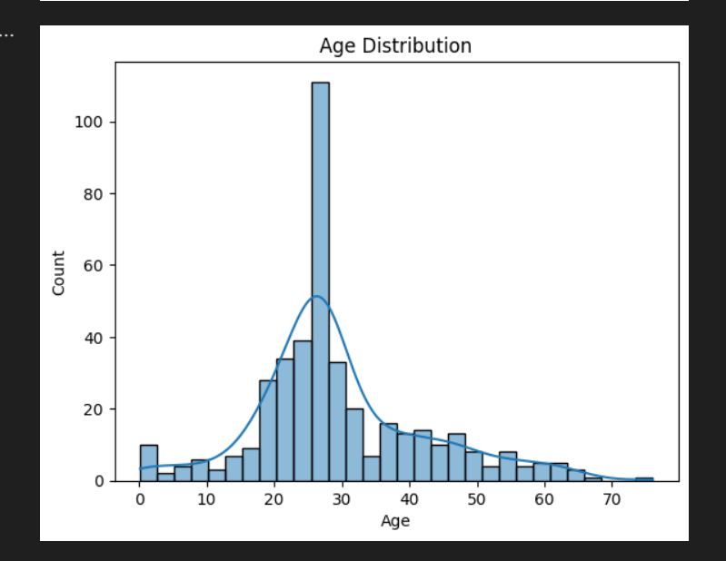

# PRODIGY_DS_02
# 🧪 Titanic EDA Project

This project performs **data cleaning** and **exploratory data analysis (EDA)** on the **Titanic dataset (test.csv)** using Python.

It is part of a data analytics task to explore relationships between passenger features such as age, class, gender, fare, and embarkation port.

---

## 📁 Files Included

| File Name | Description |
|-----------|-------------|
| `titanic_eda.ipynb` | Main Jupyter/Colab notebook with code |
| `test.csv` | Titanic test dataset (from Kaggle) |
| `age_distribution.png` | Sample visualization showing age distribution |
| `README.md` | This file describing the project |

---

## 🔧 Libraries Used

- `pandas`
- `seaborn`
- `matplotlib`

---

## 📊 Sample Output

The following chart shows the distribution of passenger ages:

---

## 📝 Key Insights

- Most passengers were aged 20–40
- 3rd class had the highest number of passengers
- More male passengers than female
- Fare varies significantly across classes

---

## 📌 How to Use

1. Open the `titanic_eda.ipynb` notebook
2. Upload `test.csv` if not already loaded
3. Run the cells to clean the data and see charts

---

## 🔗 Dataset Source

This dataset is based on the Titanic test dataset available on [Kaggle Titanic Challenge](https://www.kaggle.com/c/titanic/data)

---

## 👩‍💻 Author

Mamatha Jonnadula  
_Data Analytics Enthusiast_  
